# Lab4: Adversarial Learning and OOD Detection
This lab explores two key topics in modern deep learning security and reliability:

1. **Out-of-Distribution (OOD) Detection** – identifying when a model sees inputs it was not trained on.
2. **Adversarial Robustness** – training and evaluating models against adversarial examples.


## Project Structure
- `checkpoints/` - saved model weights for baseline and fine-tuned CNNs.

- `plots/` - visualizations for OOD samples, scores, and adversarial examples.

- `00_train.py` - script to train the CNN on CIFAR-10 (baseline and adversarially fine-tuned).

- `01_train.py` - pipeline for OOD detection and evaluation.

- `02_fgmattack.py` - implementation of iterative FGSM attacks (targeted and untargeted).

- `Cnn.py` - CNN model definition.

- `Mydata.py` - custom dataset loaders for CIFAR-10 and CIFAR-100 subsets.

- `utils.py` - helper functions.

### How to Run 00_train.py

The training script can be run in two modes: standard training or adversarially-augmented training.
```
python 00_train.py
python 00_train.py --adv_train
```
 
### How to Run 01_ood_detection.py

The OOD detection script evaluates a trained CNN on in-distribution (ID) and out-of-distribution (OOD) datasets.

Example
```
python 01_ood_detection.py --ood_set objects
```


### How to Run 02_fgmattack.py

This script generates and visualizes adversarial examples on the CIFAR-10 test set using iterative FGSM attacks. 
You can choose between untargeted or targeted attacks, set a target class, the number of samples.

Example 
``` 
python 02_fgmattack.py --attack targeted --target cat --n_samples 10
```

## Adversarial Attacks with Fast Gradient Sign Method (FGSM)

FGSM can be used for:

- **Untargeted attacks**: perturb inputs to cause misclassification.
- **Targeted attacks**: perturb inputs to be classified as a chosen target class.

I applied an iterative FGSM version that repeats the perturbation until the attack succeeds or a maximum number of steps is reached.


<table>
  <caption>Targeted and untarged attacks
  <tr>
    <td>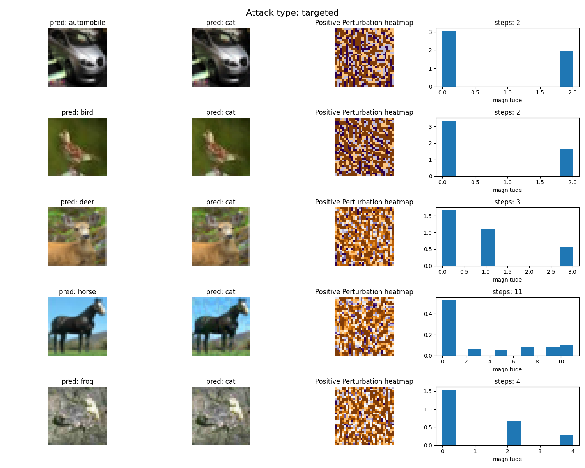</td>
    <td>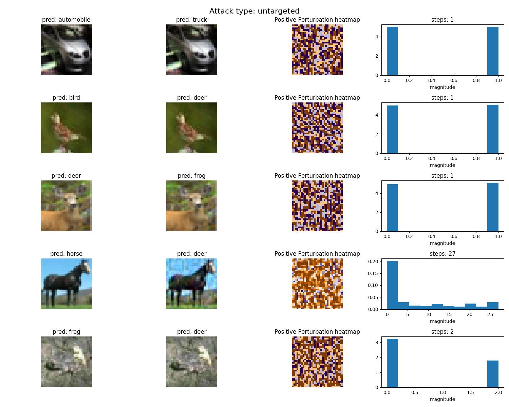</td>
  </tr>
</table>


## OOD Detection pipeline 
I implemented a basic pipeline for OOD detection.
The goal was to train a model on an in-distribution (ID) dataset and evaluate how well it distinguishes ID samples from OOD samples. I compared two models: a baseline CNN trained on CIFAR-10 and an adversarially fine-tuned version.

<table>
  <caption> ID dataset CIFAR-10  samples
  <tr>
    <td>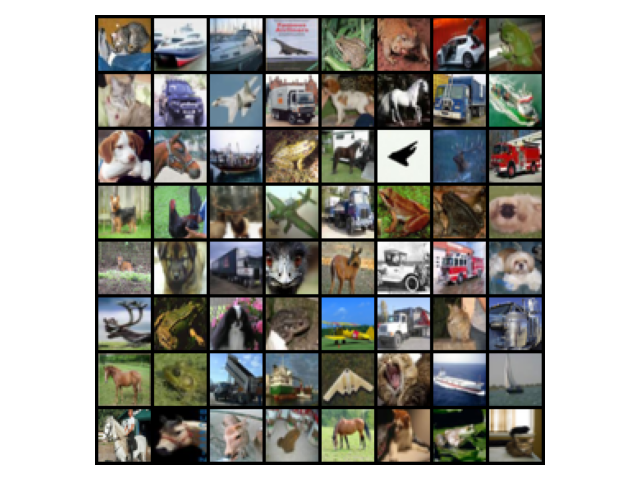 </td>
  </tr>
</table>


<table>
  <caption> OOD dataset CIFAR-100 + noise samples
  <tr>
    <td>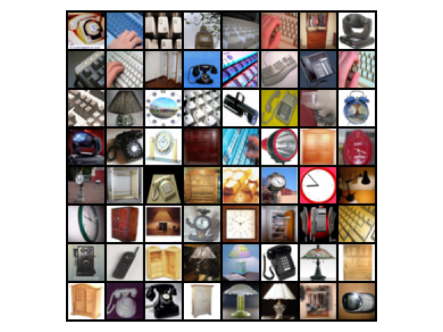</td>
    <td>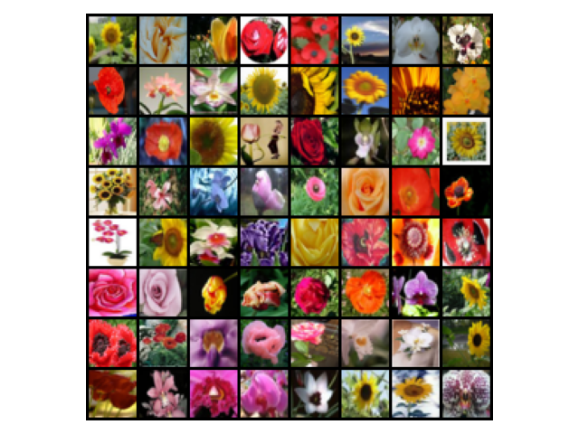</td>
    <td>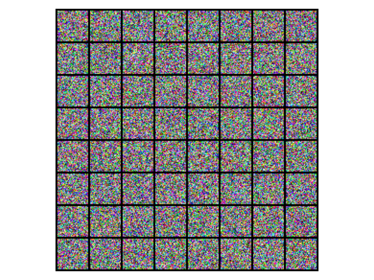</td>
  </tr>
</table>


  ### Scoring Function
  I used the maximum softmax probability as the confidence score for OOD detection


  ### Performance Metrics
  The separation between ID and OOD samples is quantified using:

  - **ROC Curve** – measures the probability that an ID sample has a higher confidence score than an OOD sample.
  - **Precision-Recall** Curve – evaluates how well the model separates ID and OOD samples across different thresholds.
  - **Area Under the Curve (AUC)** – computed for both ROC and PR curves to summarize performance in a single metric.

<table>
  <caption> Performance on objects
  <tr>
    <td>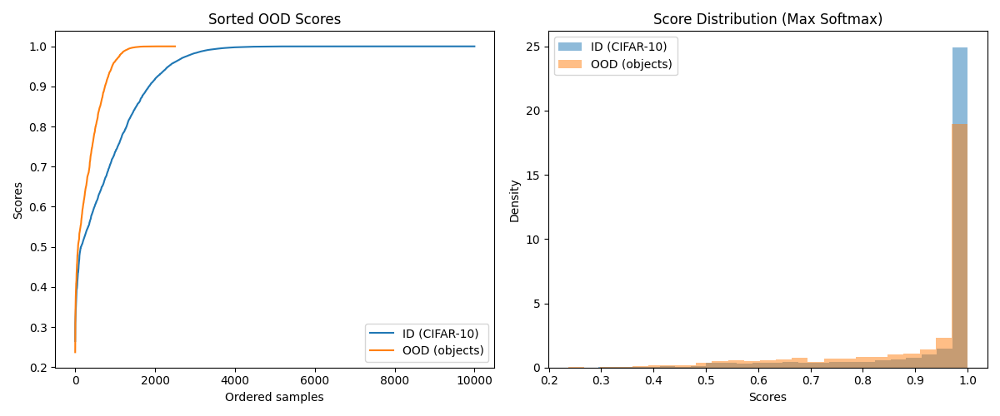</td>
    <td>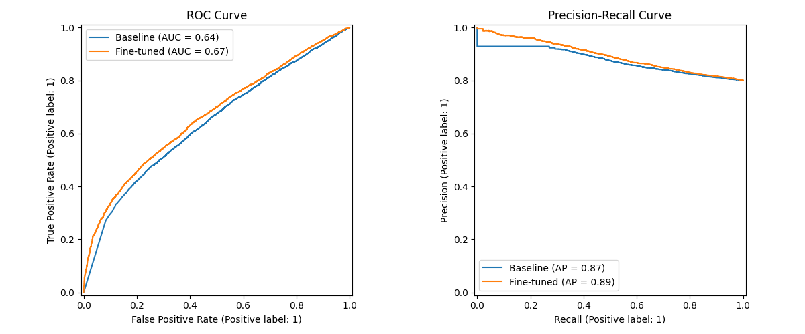</td>
  </tr>
</table>

<table>
  <caption> Performance on flowers
  <tr>
    <td></td>
    <td>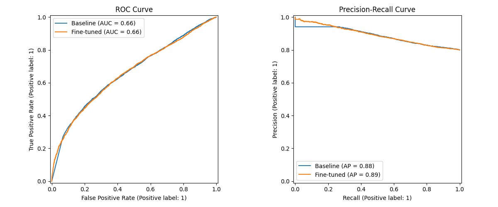</td>
  </tr>
</table>

<table>
  <caption> Performance on noise data
  <tr>
    <td>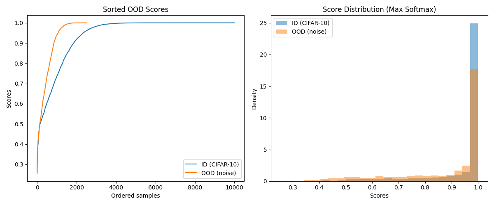</td>
    <td>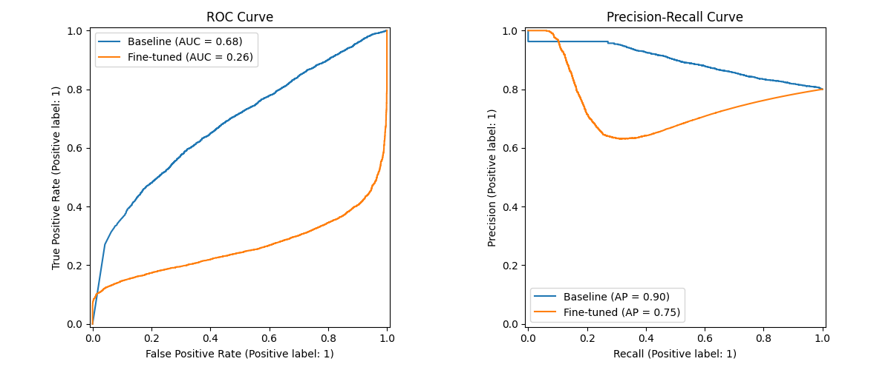</td>
  </tr>
</table>


  | OOD Set | Model      | ROC AUC | PR AUC |
  | ------- | ---------- | ------- | ------ |
  | Objects | Baseline   | 0.64    |  0.87 |
  | Objects | Fine-tuned | 0.67    |  0.89  |
  | Flowers | Baseline   | 0.66    |  0.88 |
  | Flowers | Fine-tuned | 0.66    |  0.89 |
  | Noise   | Baseline   | 0.68    | 0.90 |
  | Noise   | Fine-tuned | 0.26    | 0.75 |


  For noise, the fine-tuned model performs much worse than the baseline.
  I think this is because adversarial fine tuning makes the model focus on robust features, it improves robustness to small perturbations but reduces sensitivity to completely unstructured inputs.

